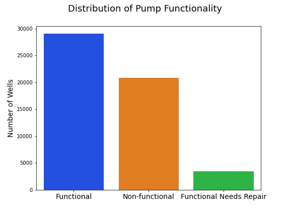
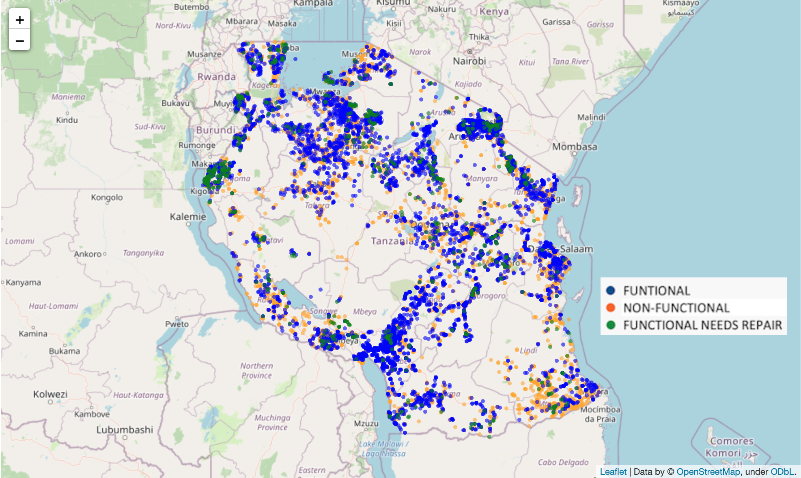
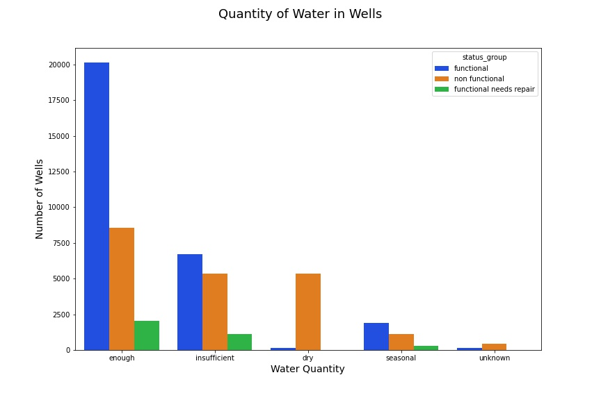

# Tanzanian Water Wells Status Prediction

**Author**: Melody Bass

 <br />

## Overview

Tanzania is a developing country that struggles to get clean water to its population of 59 million people. According to WHO, 1 in 6 people in Tanzania lack access to safe drinking water and 29 million don't have access to improved sanitation. The focus of this project is to build a classification model to predict the functionality of waterpoints in Tanzania given data provided by Taarifa and the Tanzanian Ministry of Water. The model was built from a dataset containing information about the source of water and status of the waterpoint (functional, functional but needs repairs, and non functional) using an iterative approach and can be found [here](./data/training_set_values.csv). The dataset contains 60,000 waterpoints in Tanzania and the following features will be used in our final model:

* amount_tsh - Total static head (amount water available to waterpoint)
* gps_height - Altitude of the well
* installer - Organization that installed the well
* longitude - GPS coordinate
* latitude - GPS coordinate
* basin - Geographic water basin
* region - Geographic location
* population - Population around the well
* recorded_by - Group entering this row of data
* construction_year - Year the waterpoint was constructed
* extraction_type_class - The kind of extraction the waterpoint uses
* management - How the waterpoint is managed
* payment_type - What the water costs
* water_quality - The quality of the water
* quantity - The quantity of water
* source_type - The source of the water
* waterpoint_type - The kind of waterpoint

The first sections focus on investigating, cleaning, wrangling, and reducing dimensionality for modeling. The next section contains 6 different classification models and evaluation of each, ultimately leading to us to select our best model for predicting waterpoint status based on the precision of the functional wells in the model. Finally, I will make recommendations to the Tanzanian Government and provide insight on predicting the status of waterpoints.

## Business Problem

The Tanzanian government has a severe water crisis on their hands as a result of the vast number of non functional wells and they have asked for help. They want to be able to predict the statuses of which pumps are functional, functional but need repair, and non functional in order to improve their maintenance operations and ensure that it's residents have access to safe drinking water.  The data has been collected by and is provided by Taarifa and the Tanzanian Ministry of Water with the hope that the information provided by each waterpoint can aid understanding in which waterpoints will fail.
I have partnered with the Tanzanian government to build a classification model to predict the status of the waterpoints using the dataset provided. I will use the precision of the functional wells as my main metric for model selection, as a non functional well being predicted as a functional well would be more detrimental to their case, but I will provide and discuss several metrics for each model.

## Data Understanding

The dataset used for this analysis can be found [here](./data/training_set_values.csv).  It contains a wealth of information about waterpoints in Tanzania and the status of their operation. The target variable has 3 different options for it's status:

* functional - the waterpoint is operational and there are no repairs needed
* functional needs repair - the waterpoint is operational, but needs repairs
* non functional - the waterpoint is not operational <br />

 <br />

We have the most functional wells at ~29,000, followed by non functional wells at ~21,000, and the minority class, functional needs repair at ~3,500.

## Modeling

### Dummy Classifier Model <br />

 <br />
Our baseline dummy model performed very poorly with an accuracy score of 46%. Our data is heavily imbalanced, which explains how our ternary model performed close to 50%.<br />
    
### Logistic Regression Model <br />

 <br />
Our logistic regression model is improved to 75% accuracy over the dummy model. This model struggled to predict wells that were functional but needed repairs, likely due to class imbalances. The precision of the functional class is 73%. <br />
    
### K Nearest Neighbors Model <br />

 <br />
The K Nearest Neighbors model outperformed the Logistic Regression model. Number of neighbors was hypertuned by running and GridSearch and optimal parameters were put into our pipe. Our K Nearest Neighbors model is not overfitting as the accuracy of training and test sets are 80.23% and 76.03%, respectively. The precision of the functional class is 77%, which is a huge improvement from our Logistic Regression model at 73%.<br />

### Decision Tree Model <br />

 <br />
Our decision tree model once again improved our functional class precision scores to 79%, but the model is highly overfitting with training accuracy at 89% and test accuracy at 78%.<br />
    
### Random Forests Model <br />

 <br />
Upon running GridSearch with our Random Forests Pipeline, we have once again improved from our baseline accuracy to 80% precision for the functional class over the Decision Tree model at 79%. The model is still overfitting the training data, as the training accuracy is 93.5% and the test accuracy is 81.4%, but this is our best performing model so far. <br />
 <br />
    
### XG Boost Model <br />

 <br />
Our best performing model ended up being the XG Boost model with tuned hyperparameters, although the random forests model was not far behind with 80% precision for the functional wells class. The model has overfitted the training data with a training accuracy of 92.57% and test accuracy at 81.73%, but this model boasted the highest precision score for the functional wells class at 81%. <br />
 <br />

## Conclusions

XG Boost was our top performing model, although Random Forests was not far behind.  The poor performance of the K Nearest Neighbors, Decision Tree, and Logistic Regression models indicate that the data is not easily separable.  Our XG Boost model performs with an 81.73% testing accuracy and precision for the functional class at 81%. It also had the highest f1 score of any model at 81% and the highest AUC scores at 90.5%.

Based on my findings, I am confident to partner with the Tanzanian government to help solve their water crisis by predicting water pump failure. As we illustrated above, there is a high rate of non functional waterpoints in the southeast corner of Tanzania in Mtwara and Lindi, as well as up north in Mara, and the southwest in Rukwa. These areas need immediate attention as the situations here are critical.   <br />
 <br />
There are a high number of functional wells in Iringa, Shinyanga, Kilimanjaro, and Arusha. There is a cluster of functional but need repair waterpoints in Kigoma, these should be addressed to prevent failure which can be more expensive to repair. <br />
 <br />
Several of our models showed one of it's most important features to be quantity enough for the waterpoint.  There are over 8,000 waterpoints that have enough water in them but are non functional.  These are a high priority to address as well since there is water present. <br />
 <br />
Wells with no fees are more likely to be non functional. Payment provides incentive and means to keep wells functional. <br />
 <br />
The Government, District Council, and Fini Water all have a high rate of pump failure. Investigate why these installers have such a high rate of failure or use other installers. <br />
 <br />
There are more non functional pumps than functional if they were built before 1988, but the rate of functionality keeps increasing after 1988. <br />
 <br />


Future work for this project involve improving the quality of the data moving forward. Better data trained in our model will improve the predictions. We will also monitor the wells and update the model regularly to continuously improve our strategy.

## For More Information

Please review my full analysis in [my Jupyter Notebook](./Waterwell_status_notebook.ipynb) or my [presentation](./Waterwell_status_presentation.pdf).

For any additional questions, please contact **Melody Bass @ meljoy1099@gmail.com**

## Repository Structure

```
├── data                                <- Both sourced externally and generated from code
└── images                              <- Both sourced externally and generated from code
├── README.md                           <- The top-level README for reviewers of this project
├── Waterwell_status_notebook.ipynb     <- Narrative documentation of analysis in Jupyter notebook
├── Waterwell_status_presentation.pdf   <- PDF version of project presentation
```
